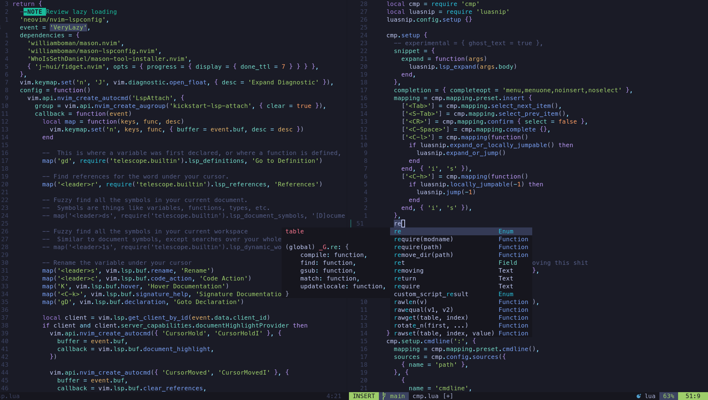

# Nvim

These are my neovim Configs, they are my revamp on [Kickstart.nvim](https://github.com/nvim-lua/kickstart.nvim). 

<p align="center">
    
</p>

If you're too lazy to build your configs from scratch and don't want a bloated distribution like [LunarVim](https://www.lunarvim.org/) or [NvChad](https://nvchad.com/) I strongly recommend just using kickstart.

If you want to learn how to create from scratch your own neovim configuration files I recommend 2 sources to learn:
1. This [Typecraft Playlist](https://www.youtube.com/watch?v=zHTeCSVAFNY&list=PLsz00TDipIffreIaUNk64KxTIkQaGguqn) will guide you to make a good modularized neovim config, but won't teach you much as how neovim configuration really works.
2. The [Kickstart](https://github.com/nvim-lua/kickstart.nvim) `init.lua` has TONS of comments explaining each decision in the config, there is the best place to learn how plugins are loaded, required, configured, lazy loaded etc, and how neovim deals with config files.

### Install 
**Warning: This command will delete your current `/nvim` directory, be careful**
```bash
rm -rf ~/.config/nvim && git clone git@github.com:PedroDrago/nvim.git ~/.config/nvim
```
