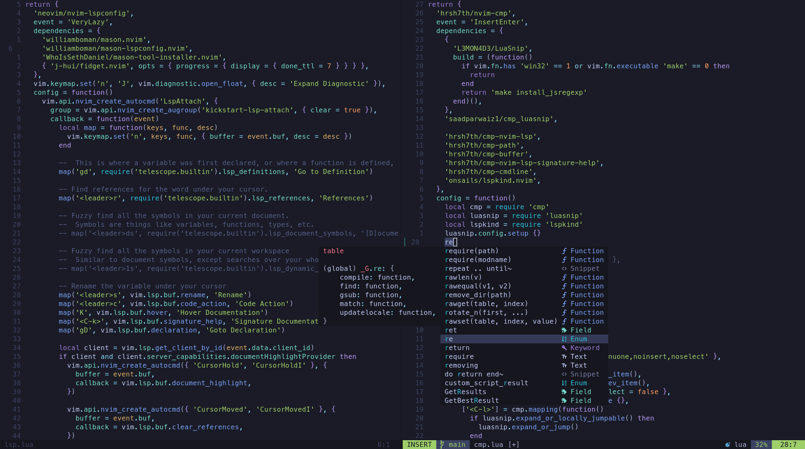

# Nvim

These are my neovim Configs

<p align="center">
    
</p>

<details><summary><b>Make your Config</b></summary>

If you're too lazy to build your configs from scratch and don't want a bloated distribution like [LunarVim](https://www.lunarvim.org/), [NvChad](https://nvchad.com/) or [LazyVim](http://www.lazyvim.org/) I strongly recommend just using [Kickstart.nvim](https://github.com/nvim-lua/kickstart.nvim). Kickstart is a concise, well configured, single file configuration with only a few selected plugins. For more info on Kickstart watch [TJ video](https://www.youtube.com/watch?v=m8C0Cq9Uv9o).

If you want to learn how to create from scratch your own neovim configuration files I recommend 2 sources to learn:

1. This [Typecraft Playlist](https://www.youtube.com/watch?v=zHTeCSVAFNY&list=PLsz00TDipIffreIaUNk64KxTIkQaGguqn) will guide you to make a good modularized neovim config with [lazy.nvim](https://github.com/folke/lazy.nvim) (the plugin manager, not the Distro), but won't teach you much how neovim configuration really works.

2. [Kickstart](https://github.com/nvim-lua/kickstart.nvim) `init.lua` have a guide as comments in the config, it will teach you basically everything you need to know to start tweaking your configs.

</details>

<details><summary><b>Plugins</b></summary>

<details><summary><b>   Navigation</b></summary>
- Telescope
</details>

### Install 
```bash
rm -rf ~/.config/nvim && git clone git@github.com:PedroDrago/nvim.git ~/.config/nvim
```
